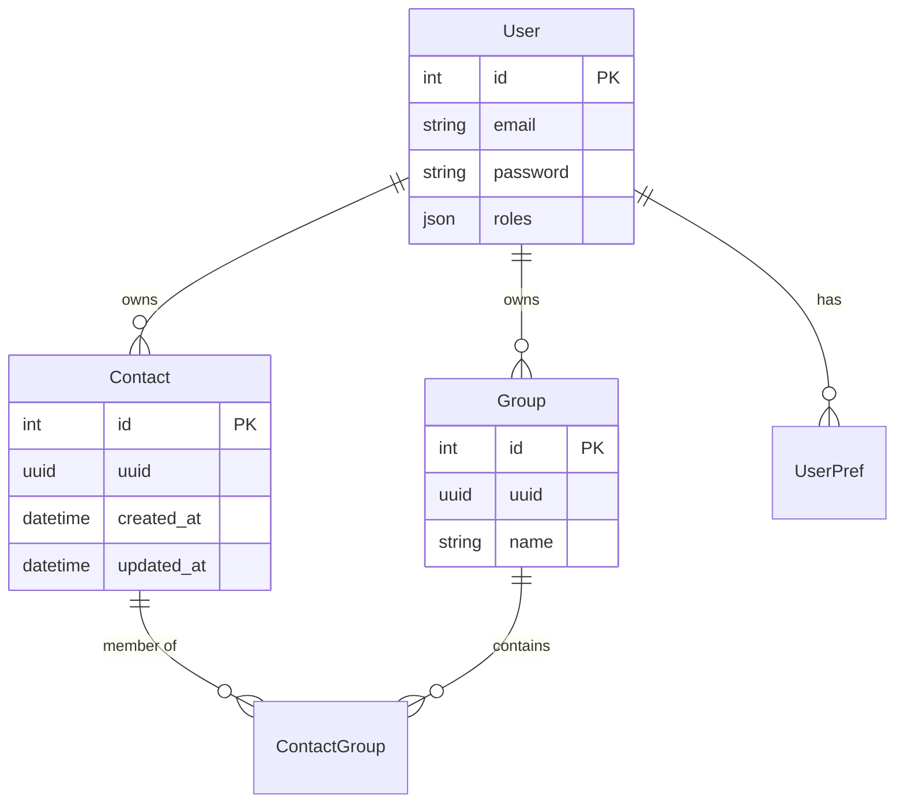
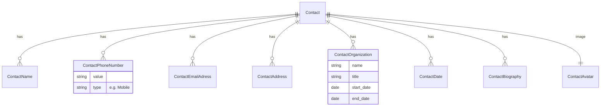
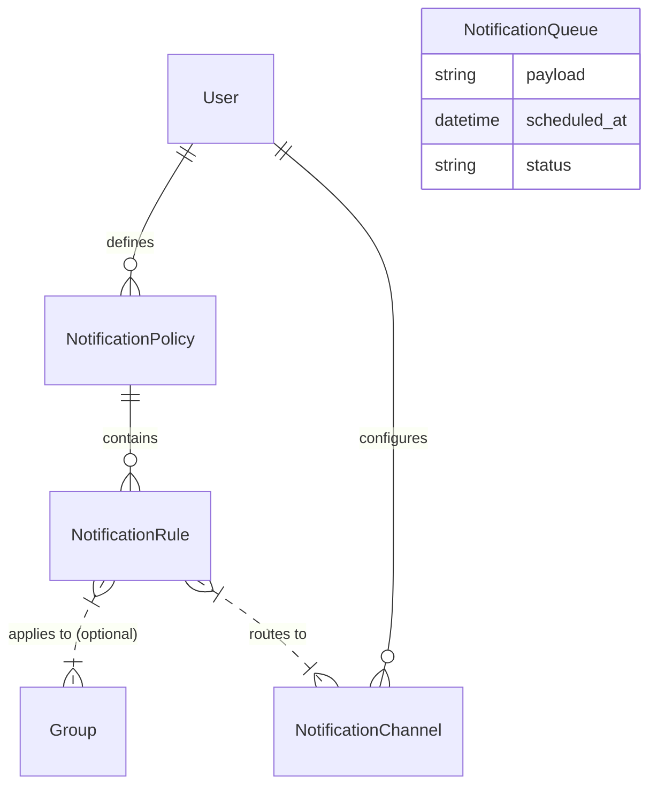

# Storage Structure & Schema

Ari uses a relational database (MySQL in production, SQLite for testing) accessed via Doctrine ORM. The schema is designed with **Multi-Tenancy** at its core, ensuring data isolation between users.

## Core Schema

 The central entities are `User` (the tenant) and `Contact`. Almost all other entities belong to a User, ensuring strict isolation.

### Key Concepts
-   **UUIDs**: All syncable entities (`Contact`, `Group`) have a UUID (`binary(16)`) to facilitate reliable import/export and synchronization across systems without ID conflicts.
-   **Tenant Awareness**: A Doctrine Filter (`TenantFilter`) automatically applies `WHERE user_id = :current_user` to queries, preventing accidental data leaks.

## Contact Attributes

Contact details are stored in normalized EAV-like (Entity-Attribute-Value) tables, usually typed (e.g., "Work", "Home").

-   **ContactRelation**: Defines relationships between two contacts (e.g., "Spouse", "Colleague"). This is a self-referencing many-to-many relationship with metadata (`type`).

## Notification System

The notification subsystem handles routing alerts to different channels based on user-defined rules.

-   **Channel**: A destination (e.g., "My Telegram", "Web Dashboard").
-   **Policy**: A collection of rules (e.g., "Default", "Holiday Mode").
-   **Rule**: Logic for *when* to send (e.g., "If event is Birthday AND contact is in Family group").

## System Audit

-   **AuditLog**: Tracks all changes (Create, Update, Delete) to entities. Stores a JSON snapshot of the entity state before and after the change (`snapshotBefore`, `snapshotAfter`).
-   **TokenStorage**: Stores OAuth tokens (e.g., Google Access/Refresh tokens).
-   **ImportMapping**: Maps external IDs (e.g., Google Resource Name) to internal Entities to track sync state.
