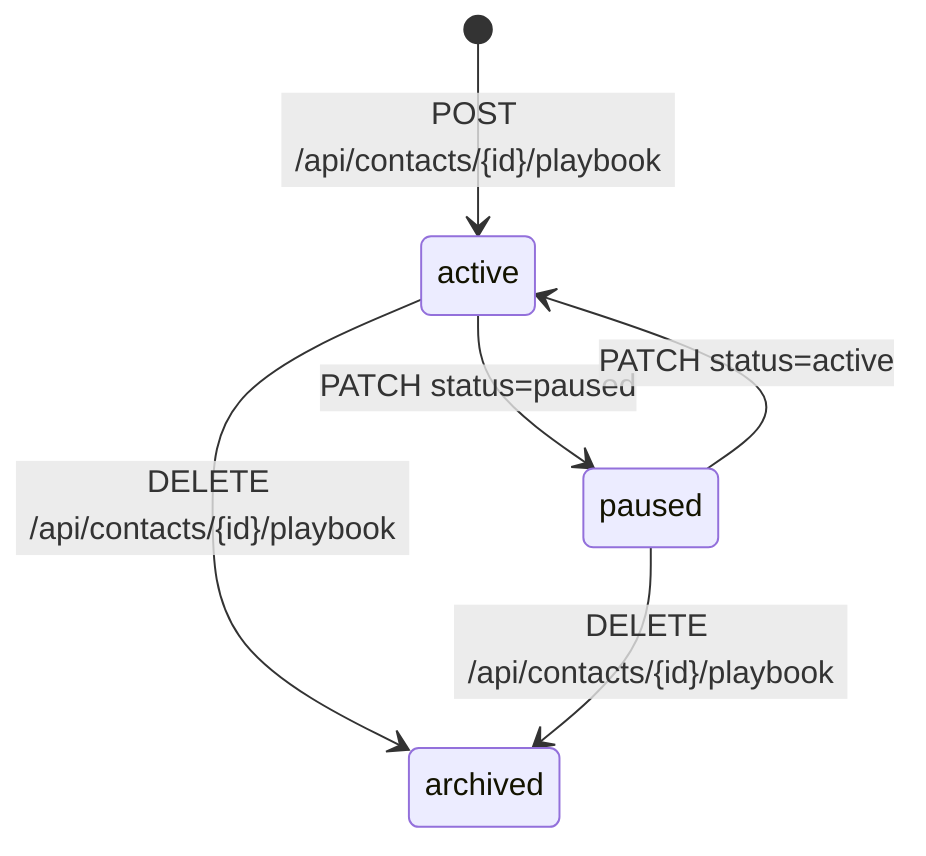
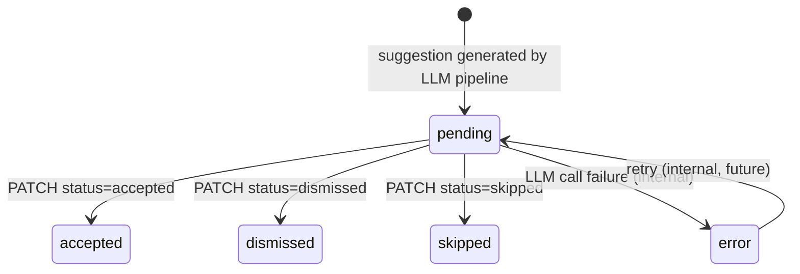

# Status Flows

This page documents the valid status transitions for the main domain entities as state machine diagrams and transition tables.

---

## ContactTask

### State Diagram

```mermaid
stateDiagram-v2
    [*] --> pending : task generated by cron

    pending --> completed : PATCH status=completed (online task)
    pending --> awaiting_reflection : PATCH status=completed (offline task)
    pending --> snoozed : PATCH status=snoozed
    pending --> archived : PATCH status=archived

    snoozed --> pending : PATCH status=pending

    awaiting_reflection --> completed : PATCH status=completed (after TaskReflection saved)
    awaiting_reflection --> completed : cron auto-finalise (> 48 h)

    pending --> paused : ContactPlaybookLifecycleService::pause()
    paused --> pending : ContactPlaybookLifecycleService::resume()
```

> Note: `paused` is a system-only status set by `ContactPlaybookLifecycleService` when the parent playbook is paused. It cannot be requested directly via the API.

### Transition Table

| From | To | Trigger | Side Effects |
|---|---|---|---|
| `pending` | `completed` | `PATCH /api/contact_tasks/{id}` with `status=completed` (online task, `isOffline=false`) | Sets `completedAt`. Dispatches `TaskCompletedEvent` → creates a `ContactInteraction`. `ContactTaskGeneratorService::generateNextTask()` schedules the next task in the series. May set `celebrationPending=true` on the parent `ContactPlaybook` if the completion is the N-th in a series (every `CELEBRATION_MILESTONE = 4`). |
| `pending` | `awaiting_reflection` | `PATCH /api/contact_tasks/{id}` with `status=completed` (offline task, `isOffline=true`) | Sets `reflectionDueAt` via `ReflectionScheduler::computeDueAt()`. `TaskReflectionFactory::createForTask()` creates a linked `TaskReflection` record with a context-specific question. The status is redirected to `awaiting_reflection` — no `ContactInteraction` is created yet. |
| `pending` | `snoozed` | `PATCH /api/contact_tasks/{id}` with `status=snoozed` and a future `snoozedUntil` date | Sets `snoozedUntil`. The task is hidden from the active task list until that date. |
| `pending` | `archived` | `PATCH /api/contact_tasks/{id}` with `status=archived` | Task is soft-archived. No interaction is created. |
| `snoozed` | `pending` | `PATCH /api/contact_tasks/{id}` with `status=pending` | Clears `snoozedUntil`. Task returns to the active queue. |
| `awaiting_reflection` | `completed` | `PATCH /api/contact_tasks/{id}` with `status=completed` (after `TaskReflection` answer is saved via `PATCH /api/task_reflections/{id}`) | Sets `completedAt`. Dispatches `TaskCompletedEvent` → creates a `ContactInteraction`. Schedules next task. `snoozedUntil` is cleared. |
| `awaiting_reflection` | `completed` | Cron: `playbooks:finalise-reflections` (hourly, auto-triggers after 48 h) | Same side effects as the manual transition above. The reflection `answer` remains `null`. |
| `pending` | `paused` | `ContactPlaybookLifecycleService::pause()` — triggered by `PATCH /api/contacts/{id}/playbook` with `status=paused` | Task is hidden. System-only; not a valid direct API transition on the task itself. |
| `paused` | `pending` | `ContactPlaybookLifecycleService::resume()` — triggered by `PATCH /api/contacts/{id}/playbook` with `status=active` | Due dates are recalculated before restoring. |
| `pending` | `archived` (bulk) | `DELETE /api/contacts/{contactId}/playbook` | All pending and paused tasks on the playbook are archived in bulk when the playbook is archived. |

---

## ContactPlaybook

### State Diagram



> `archived` is a terminal state: there is no API transition out of it. A new playbook can be activated on the same contact, which creates a new `ContactPlaybook` record.

### Transition Table

| From | To | Trigger | Side Effects |
|---|---|---|---|
| _(none)_ | `active` | `POST /api/contacts/{contactId}/playbook` with a `PlaybookActivationInput` payload | Creates the `ContactPlaybook` record. `ContactTaskGeneratorService` immediately generates the first set of tasks. Rate-limited to 20 activations per hour per user via `JwtUserRateLimiterSubscriber`. |
| `active` | `paused` | `PATCH /api/contacts/{contactId}/playbook` with `status=paused` | Calls `ContactPlaybookLifecycleService::pause()`. All `pending` tasks for this playbook are set to `paused`. No new tasks are generated while paused. |
| `paused` | `active` | `PATCH /api/contacts/{contactId}/playbook` with `status=active` | Calls `ContactPlaybookLifecycleService::resume()`. All `paused` tasks are restored to `pending` with recalculated due dates. |
| `active` or `paused` | `archived` | `DELETE /api/contacts/{contactId}/playbook` | All pending and paused tasks are archived. The `ContactPlaybook` record is soft-deleted (status set to `archived`). No further tasks are generated. |

---

## AiSuggestion

### State Diagram



> `accepted`, `dismissed`, `skipped`, and `error` are all terminal states from the client API perspective. Only the internal pipeline may produce or retry `error` records.

### Transition Table

| From | To | Trigger | Side Effects |
|---|---|---|---|
| _(none)_ | `pending` | Internal LLM pipeline (batch job or `POST /api/ai_suggestions/batch`) | A new `AiSuggestion` record is created with the suggestion `payload` (e.g. `{"locale":"lv","given":"Jānis","family":"Bērziņš","detectedLocale":"ru"}`). `providerUsed`, `modelUsed`, `tokensPrompt`, `tokensCompletion` are recorded. Uniqueness is enforced by `(tenant_id, entity_type, entity_id, suggestion_type, source_hash)` — if the source name has not changed, no duplicate is created. |
| `pending` | `accepted` | `PATCH /api/ai_suggestions/{id}` with `status=accepted` — requires `AI_SUGGESTION_RESOLVE` permission | Sets `resolvedAt`. Creates a new `ContactName` record for the contact with the locale from the suggestion payload. |
| `pending` | `dismissed` | `PATCH /api/ai_suggestions/{id}` with `status=dismissed` — requires `AI_SUGGESTION_RESOLVE` permission | Sets `resolvedAt`. Marks the suggestion as explicitly unwanted. No contact data is modified. |
| `pending` | `skipped` | `PATCH /api/ai_suggestions/{id}` with `status=skipped` — requires `AI_SUGGESTION_RESOLVE` permission | Sets `resolvedAt`. Similar to `dismissed` but signals "decide later" semantics rather than explicit rejection. |
| `pending` | `error` | Internal: LLM call fails during suggestion generation | Records the failure. `providerUsed` and `modelUsed` may be partially populated. The suggestion payload will be empty or incomplete. |
