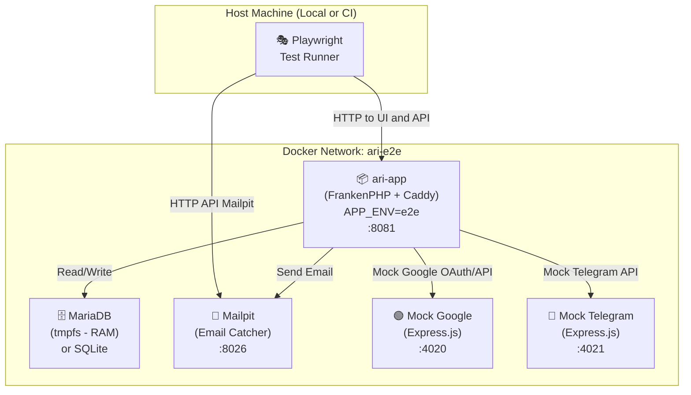

# Automated E2E Testing

The `ari-e2e` project contains End-to-End tests written using the [Playwright](https://playwright.dev/) framework.

Unlike Unit tests or API tests, E2E testing simulates real user actions in a browser. This allows us to verify the correct operation of the entire system as a whole: frontend (React), backend (Symfony), database, background jobs, and integrations with third-party services.

## 🏗 E2E Environment Architecture

To achieve determinism and speed, each test session runs in a completely isolated Docker environment that is an exact replica of Production.

### Key Decisions

1. **`APP_ENV=e2e` on Backend**: A special Symfony environment. In this mode, the kernel loads controllers necessary only for testing (e.g., database reset, data seeding, mock user generator). In Production (`APP_ENV=prod`), these endpoints physically do not exist.
2. **In-Memory Database (tmpfs)**: For the MariaDB environment, data is stored directly in RAM (tmpfs). This ensures lightning-fast database resets between test runs without wearing out the SSD.
3. **External Service Mocks**: The backend is configured so that requests to Google and Telegram servers are sent to local "stubs" (Express.js servers) deployed in the same Docker network.
4. **Unique Ports**: To prevent the E2E environment from conflicting with local development, shifted ports are used: the app is available on `:8081`, email on `:8026`, etc.

---

## 🏎 Isolation and Parallel Execution (Tenant Isolation)

One of the biggest bottlenecks in E2E testing is running tests in parallel. If two tests try to modify the same contact in the database simultaneously, they will fail (flaky tests).

Ari solves this problem elegantly: **Each test file operates with its own independent user**.

### How it works

Playwright is configured in `fullyParallel: true` mode. When a test file (`.spec.ts`) starts:
1. A special fixture `userContext` is called.
2. The fixture makes an API request to the backend: `POST /api/e2e/create-user`.
3. The backend instantly creates a new user in the database with a unique login (UUID), password, unique Email address, and a basic set of data (1 group, 1 contact).
4. Playwright authenticates the browser under this user and passes it to the test scenario.
5. The test performs any destructive actions (deletions, contact creations, etc.). Since the data is tied to a specific `tenant_id` (the user), other tests running in parallel will never see it.
6. Upon file completion, the fixture calls `DELETE /api/e2e/user/{uuid}`, deleting the user and cascadingly wiping all their data from the database.

### Global Reset

Before starting the entire test pool, a **Global Setup** is executed. This stage makes an HTTP POST request to `/api/e2e/reset`.

The backend completely clears (Truncates) absolutely all tables in the DB and inserts so-called **Seed Data** — a predictable set of base information (User "A", "B", and "Admin", contacts, groups, notification policies). These Seed Data are guaranteed to exist and can always be accessed via `tests/fixtures/test-data.ts`.

---

## 🎭 Page Object Model (POM) and `data-testid`

We adhere to the **Page Object Model** pattern. This means the logic for interacting with the interface (clicking buttons, filling out forms, finding elements) is moved into separate wrapper classes specific to a page (e.g., `LoginPage`, `ContactsPage`). The tests themselves should not hardcode locators — they should simply call human-readable methods: `await loginPage.login('user', 'pass')`.

### Interaction Locators

The project is multilingual (i18n). The "Save" button might become "Сохранить" when the locale changes.
Therefore, the primary mechanism for "hooking" automated tests is **`data-testid`**.

**Rules for finding elements:**
1. If an element contains localizable (translatable) text — find or add the `data-testid="{component}-{element}"` attribute in the React source code. Search in the test via `page.getByTestId()`.
2. If the element is a standard input field (Input, Checkbox) — use semantic search `page.getByLabel('Label Name')`.
3. Using pure text search `page.getByText()` is allowed **only** for data that we created ourselves in the DB (for example, the user name "John Doe", which has no translation).

---

## External Service Mocking

The E2E environment replaces real external APIs with lightweight Express.js mock servers. The backend reads API base URLs from environment variables, so in Docker they point to the mocks instead of production endpoints.

### Configurable URLs

All Google and Telegram API URLs are injected via Symfony `#[Autowire]` parameters with env-var overrides and sensible defaults:

| Env Variable | Default (Production) | E2E Override |
|---|---|---|
| `GOOGLE_AUTH_URL` | `https://accounts.google.com/o/oauth2/v2/auth` | `http://localhost:4020/o/oauth2/v2/auth` |
| `GOOGLE_TOKEN_URL` | `https://oauth2.googleapis.com/token` | `http://mock-google:4010/token` |
| `GOOGLE_PEOPLE_API_URL` | `https://people.googleapis.com/v1/people/me/connections` | `http://mock-google:4010/v1/people/me/connections` |
| `GOOGLE_GROUPS_API_URL` | `https://people.googleapis.com/v1/contactGroups` | `http://mock-google:4010/v1/contactGroups` |
| `GOOGLE_PEOPLE_API_BASE_URL` | `https://people.googleapis.com/v1/` | `http://mock-google:4010/v1/` |
| `TELEGRAM_API_BASE_URL` | `https://api.telegram.org` | `http://mock-telegram:4011` |

> **Note:** `GOOGLE_AUTH_URL` uses `localhost` (not Docker DNS) because the browser performs the OAuth redirect on the host machine. All other URLs use Docker-internal hostnames for server-to-server communication.

### Mock Google (port 4020)

Implements the full OAuth flow and People/Contact Groups APIs:
- `GET /o/oauth2/v2/auth` — OAuth authorization redirect (returns `code` + `state`)
- `POST /token` — Token exchange (returns mock access/refresh tokens)
- `GET /v1/people/me/connections` — List contacts (returns 3 mock contacts)
- `GET /v1/people/:resourceName` — Get single contact details
- `GET /v1/contactGroups` — List contact groups

Admin endpoints for test assertions:
- `GET /__admin/calls` — returns all API calls made to the mock
- `POST /__admin/reset` — clears the call log

### Mock Telegram (port 4021)

Implements Telegram Bot API endpoints:
- `POST /bot:token/sendMessage` — Captures sent messages
- `GET /bot:token/getMe` — Returns mock bot info
- `POST /bot:token/setWebhook` — Accepts webhook registration

Admin endpoints:
- `GET /__admin/messages` — returns all captured messages (chatId, text, timestamp)
- `POST /__admin/reset` — clears the message log

### Test Helpers

Dedicated helper modules wrap mock admin APIs for use in tests:

- **`tests/helpers/mock-google.helper.ts`** — `resetGoogleMock()`, `getGoogleCalls()`
- **`tests/helpers/mock-telegram.helper.ts`** — `resetTelegramMock()`, `getTelegramMessages()`, `waitForTelegramMessage()`
- **`tests/helpers/mailpit.helper.ts`** — `clearMessages()`, `getMessages()`, `waitForMessage()`

---

## Test Coverage Summary

| Phase | Area | Spec Files | Tags |
|---|---|---|---|
| 1 | Auth (login, register, logout) | `tests/auth/*.spec.ts` | `@smoke`, `@critical` |
| 2 | Contacts CRUD, search, details, tenant isolation | `tests/contacts/*.spec.ts` | `@crud`, `@critical` |
| 2 | Groups CRUD, filtering | `tests/groups/*.spec.ts` | `@crud` |
| 2 | Dashboard widgets | `tests/dashboard/*.spec.ts` | |
| 2 | Export (CSV, vCard) | `tests/export/*.spec.ts` | |
| 2 | Sessions, audit logs | `tests/settings/*.spec.ts` | |
| 3 | Notification channels/policies CRUD | `tests/notifications/channels-crud.spec.ts`, `policies-crud.spec.ts` | `@notifications`, `@crud` |
| 3 | Email notification delivery | `tests/notifications/delivery.spec.ts` | `@notifications`, `@delivery` |
| 4 | Google OAuth + contacts import | `tests/google-import/google-import.spec.ts` | `@google`, `@slow` |
| 4 | Telegram notification delivery | `tests/notifications/telegram-delivery.spec.ts` | `@notifications`, `@telegram` |

---

> For detailed instructions on how to run tests locally and how to write a new test, read the document [Cookbook: Writing E2E Tests](./e2e-cookbook.md).
