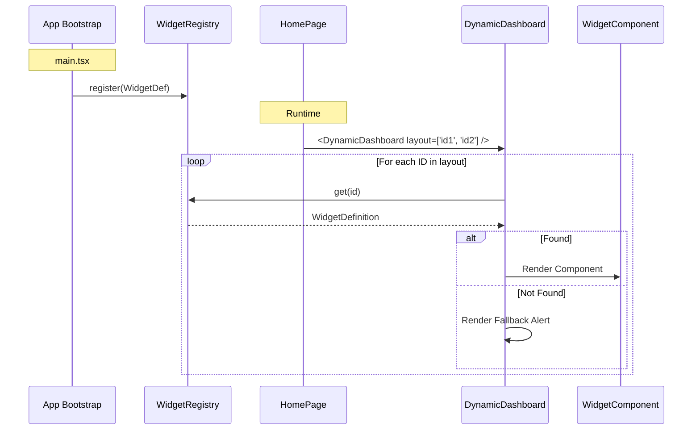

# Widget System Architecture

## Overview
The Widget System allows for a dynamic dashboard where the composition and layout of widgets can be driven by configuration rather than hardcoded logic. This enables future features such as user-customizable dashboards.

## Core Components

### 1. Widget Registry (`src/lib/widgets/WidgetRegistry.ts`)
A singleton registry that stores definitions of all available widgets in the application.

### 2. Widget Definition
Each widget is defined by a `WidgetDefinition` interface:
- **`id`**: Unique string identifier (e.g., `'recent-updates'`).
- **`title`**: Human-readable name for the catalog.
- **`component`**: The React component to render.
- **`defaultDimensions`**: Preferred dimensions (`w`, `h`) in a 12-column grid system.

### 3. Dynamic Dashboard (`src/features/dashboard/DynamicDashboard.tsx`)
A generic container that accepts a list of widget IDs (`layout`) and renders them using a responsive grid system. It handles:
- Looking up widgets in the registry.
- Applying layout dimensions (width).
- Rendering a safe fallback if a widget is missing.

## Data Flow



## Grid System
The dashboard uses a **12-column grid system**.
- **Desktop (`lg`)**: Widgets span `w` columns (1-12).
- **Tablet (`md`)**: Widgets adhere to the same 12-column system (using `md:col-span-w`).
- **Mobile**: Widgets stack vertically (full width).

## Registration
Widgets are registered at application startup. See `src/features/dashboard/widgets/registerWidgets.ts`.

---

# Cookbook: How to Create a New Widget

This guide explains how to add a new widget to the dashboard in 5 minutes.

## Checklist
1. [ ] Create the Widget Component
2. [ ] Register the Widget
3. [ ] Add to Dashboard Layout

---

## 1. Create the Widget Component
Create a new file in `src/features/dashboard/your-feature/MyNewWidget.tsx`.
ensure it handles its own data fetching (e.g., via `useQuery`).

**Boilerplate:**

```tsx
import { Star } from 'lucide-react' // Choose an icon
import { useTranslation } from 'react-i18next'
import { Card, CardContent, CardHeader, CardTitle } from '@/components/ui/card'

export default function MyNewWidget() {
  const { t } = useTranslation()

  return (
    <Card className="h-full">
      <CardHeader>
        <CardTitle className="flex items-center gap-2 text-base">
          <Star className="h-5 w-5 text-yellow-500" />
          {/* Replace with translation key */}
          <span>My New Widget</span>
        </CardTitle>
      </CardHeader>
      <CardContent>
        <p>Widget content goes here.</p>
      </CardContent>
    </Card>
  )
}
```

## 2. Register the Widget
Open `src/features/dashboard/widgets/registerWidgets.ts`.
Import your component and register it.

```typescript
import MyNewWidget from '../your-feature/MyNewWidget'

export function registerDashboardWidgets() {
  // ... existing widgets

  widgetRegistry.register({
    id: 'my-new-widget',
    title: 'My New Widget',
    component: MyNewWidget,
    defaultDimensions: { w: 4, h: 4 }, // Width: 4/12 (33%)
  })
}
```

> **Tip:** `w` is the number of columns in a 12-column grid. 
> - `12` = Full Width
> - `6` = Half Width
> - `4` = One Third
> - `3` = One Quarter

## 3. Add to Dashboard Layout
Currently, the layout is defined in `src/pages/HomePage.tsx`.
Add your widget ID to the list.

```tsx
const defaultLayout = ['groups', 'upcoming-anniversaries', 'my-new-widget']
```

## Troubleshooting
- **Widget not showing?** Check if the `id` in registration matches the `id` in `defaultLayout`.
- **Layout broken?** Ensure your total width in a row works well (e.g. dont put a `w: 7` widget next to a `w: 6` widget if you want them on one line, as 7+6=13 > 12).
